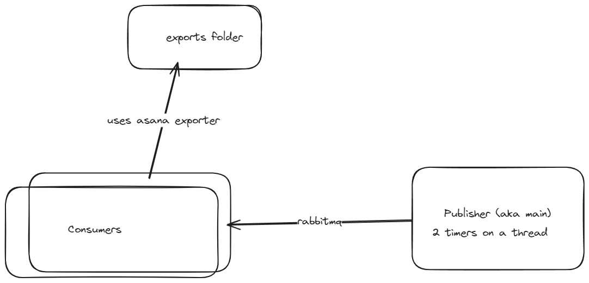

## Asana exporter

(correction: coroutine instead of thread)

### Prerequisites
* docker compose
* go 1.22.3

### How to run
1. Copy .env.example to .env
2. docker compose up (in order to start the rabbitmq locally)
3. make run-consumer (which will start the consumer)
4. make run (which will start the publisher)

The exports will be saved in the exports folder

### What I would improve next
1. Add support for limit and offset
1. Create two queues for users and projects instead of one (to be easier to scale different types of exports)
1. Make the publisher to check if the queue is not empty before pushing the tasks (since requests can be rate limited or api might change or be down)
1. Add alerts on export errors (either through sentry or other tools) in order to know when the external api is down or the consumers can't keep up with the publisher
1. Add metrics